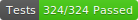

# NordVPN-Servers
[][license]
[][conduct]
[![GitHub release (semver)][img release]][release]
[![Commits since release][img commits since release]][commits]
[![Repo size][img size]][download zip]

[][test result]
[][code coverage]
[![GitHub Pages][img pages status]][pages home]
<!-- [![PowerShell Gallery][img ps gallery release]][ps gallery] -->
<!-- [![PowerShell Gallery][img ps gallery compat]][ps gallery] -->

A cross-platform PowerShell module for interacting with the NordVPN API.

## Introduction
This module provides various functions for retrieving country, grouping,
 technology, and server information from the web API provided by NordVPN.
 Possible filter parameters are generated dynamically by retrieving lists of
 valid entries from the API. A list of countries, groups, and technologies is
 stored locally as an offline fallback, and these can be updated.

## Documentation
Please see the help index **[here][help index]**.

You can also see the GitHub repository **[here][pages home]**.

## Configuration
Information on configuring the module can be found
 **[here][about settings]**.

## License
This module and its associated assets are released under the
 **[MIT license][license]**.

## Contributing
Suggestions and pull requests are welcomed, provided they are beneficial and
 well-documented. A full contributing guide can be found
 **[here][contrib]**.

### Translations
If you'd like to translate a help file, please create a pull request. Approved
 translations will also be added to the PowerShell Gallery. The module itself
 does not currently support language files.

## Requirements

<!-- [![PowerShell Gallery][img ps gallery compat]][ps gallery] -->

This module works in PowerShell Desktop 5.1 and later, and PowerShell Core 6.1
 and later. For PSCore, Windows, Linux, and macOS are supported.

## Code of Conduct

Please adhere to the **[code of conduct][conduct]** which is
 adapted from the
 [contributor covenant 2.0][cc2].
 Remember, we are a *community*.

## Changelog

The module changelog can be found **[here][changelog]**.

[license]: https://github.com/TheFreeman193/NordVPN-Servers/blob/master/LICENSE.md
[conduct]: https://github.com/TheFreeman193/NordVPN-Servers/blob/master/CODE_OF_CONDUCT.md
[release]: https://github.com/TheFreeman193/NordVPN-Servers/releases/latest
[commits]: https://github.com/TheFreeman193/NordVPN-Servers/commits/master
[changelog]: https://github.com/TheFreeman193/NordVPN-Servers/blob/master/CHANGELOG.md
[contrib]: https://github.com/TheFreeman193/NordVPN-Servers/blob/master/CONTRIBUTING.md
[help index]: ./HELPINDEX.md
[about settings]: ./about_NordVPN-Servers_Settings.md
[cc2]: https://www.contributor-covenant.org/version/2/0/code_of_conduct.html
[img release]: https://img.shields.io/github/v/release/TheFreeman193/NordVPN-Servers?sort=semver&logo=GitHub
[img commits since release]: https://img.shields.io/github/commits-since/TheFreeman193/NordVPN-Servers/latest/master?sort=semver&logo=git&label=Commits
[img pages status]: https://img.shields.io/github/deployments/TheFreeman193/NordVPN-Servers/github-pages?label=Pages%20Build
[img size]: https://img.shields.io/github/repo-size/TheFreeman193/NordVPN-Servers?logo=data:image/svg+xml;base64,PHN2ZyB4bWxucz0iaHR0cDovL3d3dy53My5vcmcvMjAwMC9zdmciIHZpZXdCb3g9IjAgMCAyOS45NzggMjkuOTc4Ij48cGF0aCBkPSJNMjUuNDYyIDE5LjEwNXY2Ljg0OEg0LjUxNXYtNi44NDhILjQ4OXY4Ljg2MWMwIDEuMTExLjkgMi4wMTIgMi4wMTYgMi4wMTJoMjQuOTY3YzEuMTE1IDAgMi4wMTYtLjkgMi4wMTYtMi4wMTJ2LTguODYxaC00LjAyNnpNMTQuNjIgMTguNDI2bC01Ljc2NC02Ljk2NXMtLjg3Ny0uODI4LjA3NC0uODI4aDMuMjQ4VjkuMjE3LjQ5NFMxMi4wNDkgMCAxMi43OTMgMGg0LjU3MmMuNTM2IDAgLjUyNC40MTYuNTI0LjQxNlYxMC40MjRoMi45OThjMS4xNTQgMCAuMjg1Ljg2Ny4yODUuODY3cy00LjkwNCA2LjUxLTUuNTg4IDcuMTkzYy0uNDkyLjQ5NS0uOTY0LS4wNTgtLjk2NC0uMDU4eiIvPjwvc3ZnPg==
[img ps gallery compat]: https://img.shields.io/powershellgallery/p/NordVPN-Servers?color=blue&label=Supports&logo=powershell&logoColor=lightblue
[img ps gallery release]: https://img.shields.io/powershellgallery/v/NordVPN-Servers?label=Gallery
[pages home]: https://github.com/TheFreeman193/NordVPNServers
[download zip]: https://github.com/TheFreeman193/NordVPN-Servers/archive/master.zip
[ps gallery]: https://www.powershellgallery.com/packages/NordVPN-Servers
[test result]: https://github.com/TheFreeman193/NordVPN-Servers/blob/master/tests/TestResult.xml
[code coverage]: https://github.com/TheFreeman193/NordVPN-Servers/blob/master/tests/CodeCoverage.xml
